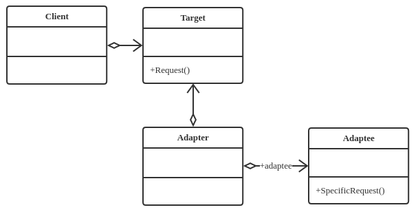

## 定义
讲一个类的接口变换成客户端所期待的另一种接口，从而使原本因接口不匹配而无法在一起工作的两个类能够一起工作

## 类型
结构类模式

## 类图


## 要素
* *Target*——目标角色
* *Adapter*——源角色
* *Adapter*——适配器角色

## 代码实现
```java
public interface Target {
    public void request();
}

public class ConcreteTarget implements Target {
    public void request() {
        System.out.println("if you need any help, pls call me!");
    }
}

public class Adaptee {
    public void doSomething() {
        System.out.println("I'm kind of busy, leave me alone, pls!")
    }
}

public class Adapter extends Adaptee implements Target {
    public void request() {
        super.doSomething();
    }
}

public class Client {
    public static void main(String[] args) {
        Target target = new ConcreteTarget();
        target.request();

        Target target2 = new Adapter();
        target2.request();
    }
}
```

## 优点

* 可以让两个没有任何关系的类在一起运行。
* 增加了类的透明性
* 提高了类的复用度
* 灵活性非常好

## 使用场景
在详细设计阶段不用考虑，而是解决正在复议的项目的问题
