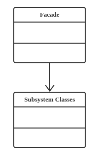

# 设计模式：门面模式（Facade Pattern）

## 定义
动态地给一个对象添加一些额外的职责。就增加功能来说，它相比生成子类更为灵活

## 类型
结构类模式

## 类图


## 代码实现
```java
public class ClassA {
    public void doSomethingA(){
        //业务逻辑
    }
}

public class ClassB　{
    public void doSomethingB() {
        //业务逻辑
    }
}

public class ClassC {
    public void doSomethingC() {
        //业务逻辑
    }
}

public class Facade {
    private ClassA a = new ClassA();
    private ClassB b = new ClassB();
    private ClassC c = new ClassC();

    public void methodA() {
        this.a.doSomethingA();
    }
    public void methodB() {
        this.b.doSomethingB();
    }
    public void methodC() {
        this.c.doSomethingC();
    }
}
```

## 优点
* 减少系统的互相依赖
* 提高了灵活性
* 提高安全性

## 缺点
不符合开闭原则

## 使用场景
* 为一个复杂的模块或子系统提供一个供外界访问的接口
* 子系统相对独立——外界对子系统的访问只要黑箱操作即可
* 预防低水平人员带来的风险扩散
