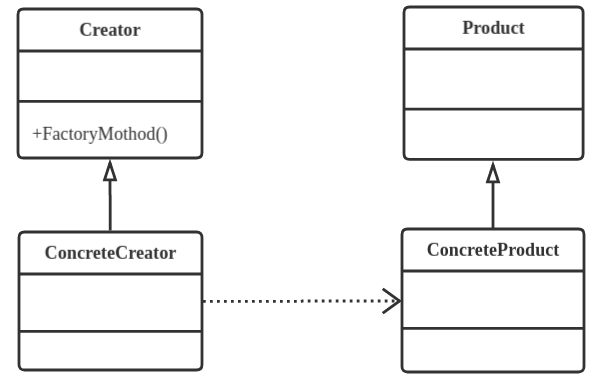

# 设计模式：工厂方法模式（Factory Method Pattern）

## 定义
定义一个用于创建对象的接口，让子类决定实例化哪一个类，工厂方法使一个类的实例化延迟到其子类。

## 类型
创建类模式

## 类图



## 模板代码
```java
interface IProduct {  
    public void productMethod();  
}  

class Product implements IProduct {  
    public void productMethod() {  
        System.out.println("产品");  
    }  
}  

interface IFactory {  
    public IProduct createProduct();  
}  

class Factory implements IFactory {  
    public IProduct createProduct() {  
        return new Product();  
    }  
}  

public class Client {  
    public static void main(String[] args) {  
        IFactory factory = new Factory();  
        IProduct prodect = factory.createProduct();  
        prodect.productMethod();  
    }
}
```

## 典型应用
汽车由发动机、轮、底盘组成，现在需要组装一辆车交给调用者。假如不使用工厂模式，代码如下：

```java
class Engine {  
    public void getStyle(){  
        System.out.println("这是汽车的发动机");  
    }  
}  
class Underpan {  
    public void getStyle(){  
        System.out.println("这是汽车的底盘");  
    }  
}  
class Wheel {  
    public void getStyle(){  
        System.out.println("这是汽车的轮胎");  
    }  
}  
public class Client {  
    public static void main(String[] args) {  
        Engine engine = new Engine();  
        Underpan underpan = new Underpan();  
        Wheel wheel = new Wheel();  
        ICar car = new Car(underpan, wheel, engine);  
        car.show();  
    }  
}  
```

可以看到，调用者为了组装汽车还需要另外实例化发动机、底盘和轮胎，而这些汽车的组件是与调用者无关的，严重违反了迪米特法则，耦合度太高。并且非常不利于扩展。另外，本例中发动机、底盘和轮胎还是比较具体的，在实际应用中，可能这些产品的组件也都是抽象的，调用者根本不知道怎样组装产品。假如使用工厂方法的话，整个架构就显得清晰了许多。
```java
interface IFactory {  
    public ICar createCar();  
}  
class Factory implements IFactory {  
    public ICar createCar() {  
        Engine engine = new Engine();  
        Underpan underpan = new Underpan();  
        Wheel wheel = new Wheel();  
        ICar car = new Car(underpan, wheel, engine);  
        return car;  
    }  
}  
public class Client {  
    public static void main(String[] args) {  
        IFactory factory = new Factory();  
        ICar car = factory.createCar();  
        car.show();  
    }  
}  
```

## 适用场景

* 首先，作为一种创建类模式，在任何需要生成复杂对象的地方，都可以使用工厂方法模式。有一点需要注意的地方就是复杂对象适合使用工厂模式，而简单对象，特别是只需要通过new就可以完成创建的对象，无需使用工厂模式。如果使用工厂模式，就需要引入一个工厂类，会增加系统的复杂度。
* 其次，工厂模式是一种典型的*解耦模式*，*迪米特法则在工厂模式中表现的尤为明显*。假如调用者自己组装产品需要增加依赖关系时，可以考虑使用工厂模式。将会大大降低对象之间的耦合度。
* 再次，由于工厂模式是依靠抽象架构的，它把实例化产品的任务交由实现类完成，扩展性比较好。也就是说，当需要系统有比较好的扩展性时，可以考虑工厂模式，不同的产品用不同的实现工厂来组装。

## 优点
* 可以使代码结构清晰，有效地封装变化。
* 对调用者屏蔽具体的产品类
* 降低耦合度
