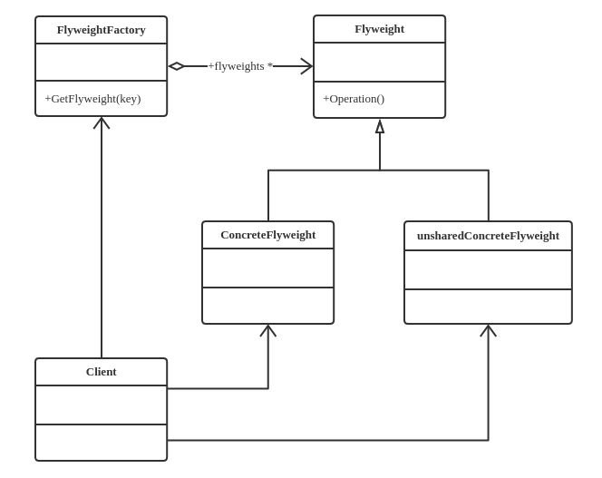

# 设计模式：享元模式模式（Flyweight Pattern）

## 定义
动态地给一个对象添加一些额外的职责。就增加功能来说，它相比生成子类更为灵活

## 类型
结构类模式

## 类图


## 代码实现
```java
public abstract class Flyweight{
    //内部状态
    private String intrinsic;
    //外部状态
    protected final String Extrinsic;
    //享元角色必须接受外部状态
    public Flyweight(String _Extrinsic){
        this.Extrinsic = _Extrinsic;
    }

    public abstract void operate();

    public String getIntrinsic() {
        return intrinsic;
    }

    public void setIntrinsic(String intrinsic){
        this.intrinsic = intrinsic;
    }
}

public class ConcreteFlyweight1 extends Flyweight{
    public ConcreteFlyweight1(String _Extrinsic){
        super(_Extrinsic);
    }
    public void operate(){
        //业务逻辑
    }
}

public class ConcreteFlyweight2 extends Flyweight{
    public ConcreteFlyweight2(String _Extrinsic){
        super(_Extrinsic);
    }
    public void operate(){
        //业务逻辑
    }
}

public class FlyweightFactory{
    private static HashMap<String, Flyweight> pool = new HashMap<String, Flyweight>();

    //享元工厂
    public static Flyweight getFlyweight(String Extrinsic){
        Flyweight flyweight = null;

        if(pool.containsKey(Extrinsic)){
            flyweight = pool.get(Extrinsic);
        }else{
            flyweight = new ConcreteFlyweight1(Extrinsic);
            pool.put(Extrinsic, flyweight);
        }
        return flyweight;
    }
}
```

## 优点
大大减少应用程序创建的对象，减低程序内的占用，增强程序的性能

##　缺点
提高了系统的复杂性，需要分离出外部状态和内部状态。

## 使用场景
* 系统中存在大量的相似对象
* 细粒度的对象都具备较结晶的外部状态
* 需要缓冲池的场景
