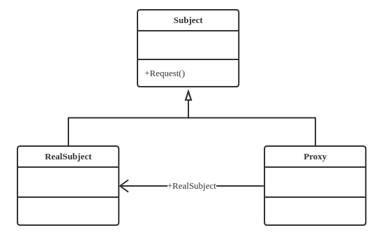

## 定义
为其他对象提供一种代理以控制对这个对象的访问

## 类型
结构类模式

## 类图


## 角色

* *Subject*——抽象主题角色
* *RealSubject*——具体主题角色
* *Proxy*——代理主题角色

## 代码实现
```java
public interface Subject {
    public void request();
}

public class RealSubject implements Subject {
    public void request(){
        //业务逻辑处理
    }
}

public class Proxy implements Subject {
    private Subject subject = null;

    public Proxy() {
        this.subject = new Proxy();
    }

    public Proxy(Object...object){

    }

    public void request() {
        this.before();
        this.subject.request();
        this.after();
    }

    private void before() {

    }

    private void after() {

    }
}
```

## 优点
* 职责清晰
* 高拓展性
* 智能化
