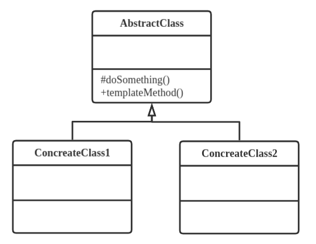

## 定义
定义一个操作中算法的框架，而将一些步骤延迟到子类中，使得子类可以不改变算法的结构即可重定义该算法中的某些特定步骤。

## 类型
行为类模式

## 类图


模版方法是编程中一个经常用到的模式。

```java
//抽象模板类
public abstract class AbstractClass {
    //基本方法，不同实现
    protected abstract void doSomething();
    //模板方法，相同
    public void templateMethod() {
        //调用基本方法，完成相关逻辑
        this.doSomething();
    }
}

//具体模板类
public class ConcreateClass1 extends AbstractClass {
    protected void doSomething() {
        //业务逻辑
    }
}
//省略 ConcreateClass2

public class Client {
    public static void main(String[] args) {
        AbstractClass class1 = new ConcreateClass1();
        AbstractClass class2 = new ConcreateClass2();

        class1.templateMethod();
        class2.templateMethod();
    }
}
```

## 模板方法优点
* 封装不变部分，拓展可变部分
* 提取公共部分代码，便于维护
* 行为由父类控制，子类实现，符合开闭原则

## 模板方法缺点
按照习惯，抽象类负责声明最抽象，最一般的事物属性和方法，实现类完成具体的事物属性和方法。但是模板类却颠倒这个顺序，抽象类定义了部分抽象方法，由子类实现，子类执行的结果影响父类的结果，在复杂项目中带来了代码阅读的难度，让新手不适应。

## 使用场景
* 多个子类有公有的方法，并且逻辑基本相同
* 重要，复杂的算法，可以吧核心算法设计为模板方法，周边的相关细节功能则由各个子类实现
* 重构时，把相同代码收取到父类中，让后通过钩子函数约束其行为。
