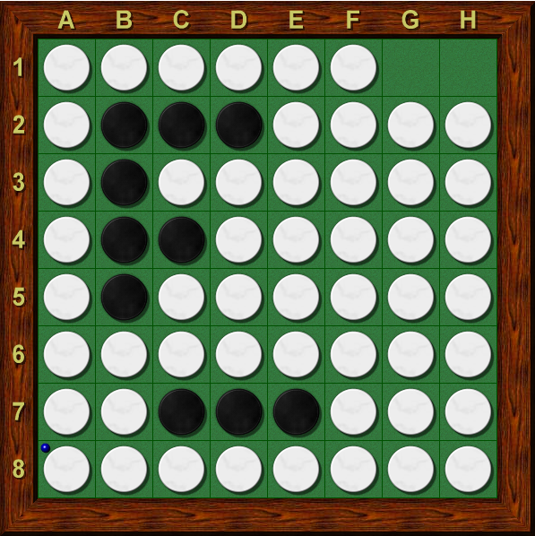

## 背景
在开发[Reversi_process](https://github.com/shianqi/Reversi_process)
（ 用NodeJS 将黑白棋对局的每一步保存成本地图片的）的时候，遇到这样的需求：
先在 Node-Canvas 画出每一步的图片，然后保存下来。
在绘制下一张图片的时候，要保证前一张图片被保存下来。不然保存的图片可能会乱。

但是如果用同步的方法保存，整个过程下来是相当的费时。
生成一个有60步的对局大约需要 12000ms 。于是有了下面这个解决办法。

## 环境
* NodeJs: v7.9.0
* node-canvas: 1.6.5

阅读前需要对 Promise 和 async/await 有一定了解 

## 异步进行 Canvas 保存成图片
首先，将异步 fs.writeFile 封装成一个 [Promise](https://developer.mozilla.org/en-US/docs/Web/JavaScript/Reference/Global_Objects/Promise) 方法。
```NodeJs
/**
 * 将buffer数据保存到指定的文件夹下
 * @param name 新图片的名字
 * @param dataBuffer 图片数据
 * @returns {Promise}
 */
DrawChessboard.prototype.saveImg = function(name, dataBuffer){
	"use strict";
	return new Promise((resolve, reject)=>{
		fs.writeFile(this.path + '/' + name + ".png",dataBuffer, function (err) {
			if(err) reject(err);
			resolve();
		})
	});
};
```
之后，我们用一个数组来存每一步的 Promise 对象，在保存每一步 Canvas 图像的时候
我们创建一个当前 Canvas 的副本。如果直接传入当前 Canvas 的时候，会导致保存后的图片乱掉。

在这里我们使用了 `toDataURL()` 的异步使用方法

```
canvas.toDataURL('image/png', function(err, png){ });
```

因为 `toDataURL()` 将非常耗时，在本例中，平均保存一步对局需要 600ms

在 `toDataURL()` 回调中，我们调用上面封装成 Promise 方法的 `saveImg(name, dataBuffer)`
方法，并将返回的 Promise 对象添加到 promises 数组中。

之后我们只要保证 promises 中的 Promise 全部执行完成就可以了。

只要调用 `Promise.all( iterable )`; 将 promises 传入即可，等待 promises 方法全部执行完后
返回一个新的 Promise 对象，处理之后便可以进行之后的工作了。


代码如下（使用了 async/await 新特性，NodeJs v7.4.0 后正式加入）
```NodeJs
DrawChessboard.prototype.draw = async function (/*string*/chessString) {
    //---
    //省略若干步
    //---
    
    //保存每一步的Promise对象
    let promises = [];
    
    for(let i=0;i<length;i++){
        //计算这一步的棋局
        this.computeChess(chessArray[i*2],chessArray[i*2+1]);
        //在Canvas上绘制这一步棋局
        this.drawChess();
    
        //为了在异步操作不导致两次 toDataURl() 有影响，这里创建了一个当前 canvas 副本。
        let newCanvas = new Canvas(this.size_x, this.size_y);
        let newCtx = newCanvas.getContext('2d');
        let imageDate = this.ctx.getImageData(0,0,this.size_x,this.size_y);
        newCtx.putImageData(imageDate,0,0);
    
        //此处 toDataURL() 为异步操作，如果同步操作则非常耗时，此处约600ms执行完成。
        newCanvas.toDataURL("image/png",(err,png)=>{
            let base64Data = png.replace(/^data:image\/\w+;base64,/, "");
            let dataBuffer = new Buffer(base64Data, 'base64');
            promises.push(this.saveImg(i,dataBuffer));
        });
    }
    try {
        await Promise.all(promises);
    }catch (err){
        console.log(err);
    }
    return this.canvas.toDataURL();
}
```